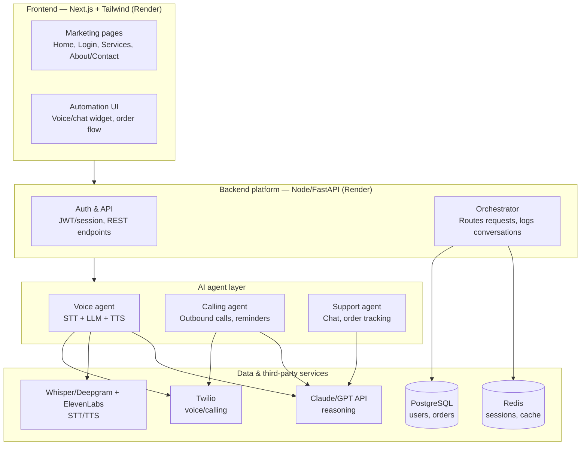

# System architecture

This document describes the architecture of the company website + AI automation platform built for the Senior AI Full Stack Developer assignment.

## Overview diagram

## Layer breakdown

### 1. Frontend — Next.js + Tailwind
- **Marketing pages**: Home, Login/Signup, Services, About/Contact — server-rendered for SEO, responsive for mobile.
- **Automation UI**: the e-commerce/automation page where the AI agents are demoed (voice widget, chat widget, order flow).
- Deployed on Render.

### 2. Backend platform — Node.js (Express/NestJS) or FastAPI
- **Auth & API**: handles login/signup, JWT/session management, and the core REST endpoints for orders and users.
- **Orchestrator**: a service that routes requests between the frontend, the AI agents, and the database; also logs every conversation/call for review.
- Deployed on Render.

### 3. AI agent layer
- **Voice agent**: inbound/outbound voice interactions — speech-to-text → LLM reasoning → text-to-speech.
- **Calling agent**: automated outbound calls (appointment reminders, lead follow-up, cart recovery) via a telephony API.
- **Support agent**: website chat widget for support, product recommendations, and order tracking, using tool-use/function-calling.

### 4. Data & third-party services
- **PostgreSQL**: structured data — users, orders.
- **Redis**: session storage and caching.
- **Twilio**: telephony for voice and calling agents.
- **Claude/GPT API**: the reasoning layer behind all three agents.
- **Whisper/Deepgram + ElevenLabs**: speech-to-text and text-to-speech for the voice agent.

## How this maps to the deliverables checklist
- **Design**: this diagram plus a Figma file covering the frontend pages.
- **Frontend code**: the `FE` layer above, in the same GitHub repo as backend.
- **Backend code**: the `BE` layer, exposing REST/GraphQL APIs.
- **AI agent integration**: at least one working agent from the `AI` layer (voice or chat), documented here with mock/sandbox APIs if needed.
- **Deployment**: live links for both `FE` and `BE`, deployed on Render.
- **Documentation**: this file, plus setup steps in the main README.
